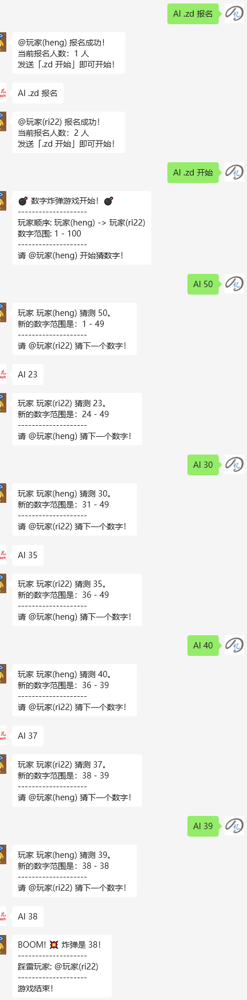

# 数字炸弹 (Digital Bomb) - 群聊小游戏插件

这是一个为基于 `xbot` 的微信机器人设计的“数字炸弹”小游戏插件。它允许在微信群聊中发起一个有趣的多人互动游戏。玩家们轮流在一个动态变化的数字范围内猜测一个数字，猜中预设“炸弹”数字的玩家即为失败者。

## 示例


## ✨ 功能特性

* **配置灵活**：你可以通过配置文件轻松启用或禁用插件，并完全自定义游戏的触发指令。
* **参数可调**：支持自定义最小游戏人数以及炸弹的数字范围。
* **自动化流程**：插件自动处理玩家报名、随机化玩家顺序、更新数字范围，并轮流提示下一位玩家。
* **清晰的游戏指引**：在游戏的每个阶段（报名、开始、轮到玩家、游戏结束）都会有清晰的文本提示，并使用 `@` 功能提醒相关玩家。
* **状态管理**：为每个群聊独立管理游戏状态，不同群聊的游戏互不干扰。
* **安全健壮**：仅在群聊中响应指令，并包含配置加载的异常处理，确保插件的稳定运行。

## ⚙️ 安装与配置


下载本项目并解压到插件目录下即可

下面是一个配置文件的示例，你可以直接复制并根据需要修改：

**`config.toml`**

```toml
# 基础设置
[basic]
# 插件总开关，true 为开启，false 为关闭
enable = true

# 指令设置
# 你可以把 "数字炸弹"、"报名" 等改成你喜欢的任何指令
[commands]
main = "数字炸弹" # 主指令，所有子指令都需要带上它
signup = "报名"    # 报名游戏的指令
start = "开始游戏"  # 开始游戏的指令
end = "结束游戏"    # 强制结束游戏的指令

# 游戏参数设置
[game_settings]
min_players = 2 # 开始游戏所需的最少玩家人数
min_range = 1   # 炸弹数字的最小范围
max_range = 100 # 炸弹数字的最大范围
```

## 🎮 使用方法

游戏的所有操作都通过在群聊中发送特定指令来完成。指令的格式为：**主指令 + 子指令** (例如: `数字炸弹 报名`)。

### 游戏流程

1.  **发起与报名**
    * 任何群成员可以发送报名指令来加入游戏。
    * **指令**: `{主指令} {报名指令}` (默认: `数字炸弹 报名`)
    * 机器人会确认报名成功，并显示当前报名人数。

2.  **开始游戏**
    * 当报名人数达到 `min_players` 配置的数量后，任意玩家可以发送开始指令。
    * **指令**: `{主指令} {开始指令}` (默认: `数字炸弹 开始游戏`)
    * 游戏开始后，机器人会公布玩家顺序、数字范围，并 `@` 提醒第一位玩家开始猜数字。

3.  **进行游戏 (猜数字)**
    * 轮到的玩家需要直接在群里发送一个位于当前范围内的数字。
    * 如果猜错，机器人会根据猜测的数字缩小范围，并 `@` 提醒下一位玩家。
    * 如果猜中“炸弹”，游戏结束，机器人会公布踩雷的玩家。

4.  **结束游戏**
    * 如果想在游戏分出胜负前提前结束，可以发送结束指令。
    * **指令**: `{主指令} {结束指令}` (默认: `数字炸弹 结束游戏`)
    * 机器人会清空当前群聊的游戏状态。

### 指令汇总

| 操作 | 默认指令 | 说明 |
| :--- | :--- | :--- |
| **报名** | `数字炸弹 报名` | 玩家加入游戏。 |
| **开始** | `数字炸弹 开始游戏` | 报名结束后，正式开始游戏。 |
| **猜数** | `[一个数字]` | 轮到的玩家直接发送数字，例如 `50`。 |
| **结束** | `数字炸弹 结束游戏` | 强制中止本局游戏。 |

